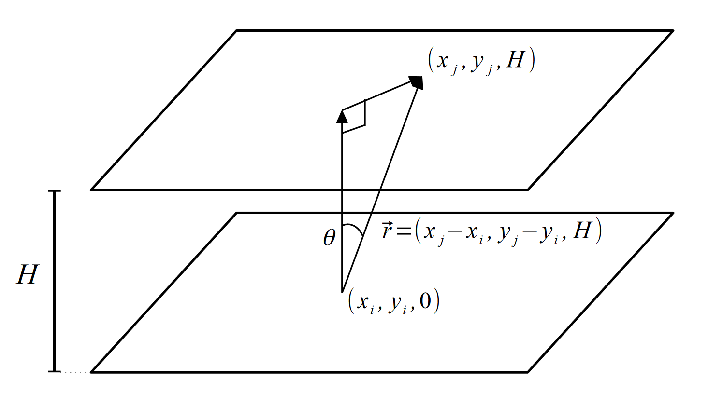

# Uniform irradiation LED arrangement optimization using approximation of integral equation

Kim, Hyeaonsung

*School of physics and photonics, Gwangji Insititute of Scoence and Technology, 123 Chamdan St. Gwangju, Korea*

\* *qwqwhsnote@gm.gist.ac.kr*

**Abstract**

© 2021 Optical Society of America under the terms of the [OSA Open Access Publishing Agreement](https://www.osapublishing.org/library/license_v1.cfm)

## 1. Introduction

## 2. Mathematical Construction

Common LED intensity model is a Lambertian intensity distribution model[^Lamber] with an inverse square law.

$$I(r, \theta) = \frac{I_0}{r^2}\cos^m(\theta)$$

Where $I_0$ is an intensity that LED emits perpendicular to its surface, $\theta$ is an angle between perpendicular vector and direction vector to point from center of the LED, and $m$ is a number, determing the optical property. 

**Fig. 1**  Geometrical Schematic diagram of target plane and LED array plane.$(x_i,y_i,0)$ is a i-th LED location coordinate on below plane. $(x_j,y_j,0)$ is a sample point on target plane above LED plane.

### 2-1. 1-dimension array

Consider 1-dimensional array of LED and line with a distance $H$ from the array surface. For, i-th LED and j-th sample point, the distance $r$ and view-angle $\theta$ can be calculated as next with a location coordinate value $x,t$ of each line whose origins are located on same perpendicular line.

$$r_{ij} = \sqrt{H^2 + (x_i -t)^2}$$

$$\theta_{i} = \arctan(\frac{|x_i - t|}{H})$$

With a Lambertian distribution model, the intensity of the j-th sample point $I$ is

$$I(t) := \sum_{i=1}^N I(x_i,t)= I_0 \sum_{i=1}^N \frac{H^m}{(H^2 + (x_i - t)^2)^(\frac{m}{2} +1)}$$

for $N$ LEDs. To reduce the complexity of the calculation we consider all LEDs have same optical properties in radiation power and distribution.

Now, assume that the LEDs are located in the closed region which length is $W$. We will only consider the intensity in this region on the above line. In other word, it means $x, t \in [-\frac{W}{2}, \frac{W}{2}]$ region. Using Kronecker delta function, we can represent the specific arrangement $\{ x_i \}_{i=1}^N$ of the LEDs as array function $\sigma$ and define the function $f(x,t)$ as next.

$$\sigma(x, \{ x_i \}_{i=1}^N) := \sum_{i=1}^N \delta(x-x_i)$$
$$f(x,t) := \frac{H^m}{(H^2 + (x - t)^2)^{(\frac{m}{2} +1)}}$$

With these definition, we can rewrite the intensity at $t$ point.

$$I(t) = f(x,t) \sigma(x, \{ x_i \}_{i=1}^N)$$

Our goal is finding an optimized arrangement $\{x_i \}_{i=1}^N$ which determines the array function $\sigma(x, \{ x_i \}_{i=1}^N)$.  However, the number of the LED $N$ is not important. We will concentrate on tendency of the $\sigma(x, \{ x_i \}_{i=1}^N)$ by $x$ values for general modification. Thus, we assume the continous function $\sigma_C(x)$ defined on $[-\frac{W}{2}, \frac{W}{2}]$. We can get $\sigma(x, \{ x_i \}_{i=1}^N)$ with discretizing $\sigma_C(x)$. 

$$D_N(\sigma_C(x)) = \sigma(x, \{ x_i \}_{i=1}^N)$$

Intuitively, we can infer some properties of the function $\sigma_C(x)$. For example, it will show a narrow distance between two consecutive elements $x_n$, $x_{n+1}$ near boundary than they are located near center point, because, when they have same distance, those array showed smaller intensity value near the boundary than central value. 

$$\sigma_C(x) \geq 0 , \forall x \in [-\frac{W}{2}, \frac{W}{2}]$$
$$\sigma_C(x) = \sigma_C(-x)$$
$$\sigma_C(x_1) \leq \sigma_C(x_2), |x_1| < |x_2|, x_1,x_2 \in [-\frac{W}{2}, \frac{W}{2}]$$

The initial step is determine the function $\sigma_C (x)$. We cannot construct it directly. Therefore, we can approximate using interpolation method with sample point set $\{x_j \}_{j=1}^n , \{ t_k \}_{k=1}^n$. These point set is discretizing the region $[-\frac{W}{2}, \frac{W}{2}]$ with $n$ number of interval points. 

$$x_j = (j-\frac{1}{2})\frac{W}{n}-\frac{W}{2}, t_k = (k-\frac{1}{2})\frac{W}{n}-\frac{W}{2}$$

For sample point $t_k$, the intsnsity $I_k = I(t_k)$ is

$$I(t_k) = \sum_{j=1}^n f(x_j, t_k) \sigma_C(x_j)$$

Therefore, we can construct linear system

$${\bf{F}} \vec{\sigma_C} = \vec{I}$$

,where $\bf{F} \in M_{n\times n}(\mathbb{R})$ and $\vec{\sigma_C}, \vec{I} \in \mathbb{R}^n$. Each elements are defined as

$${\bf{F}}_{jk} := f(x_j, t_k)$$
$$\vec{\sigma_C}_j := \sigma_C(x_j)$$
$$\vec{I}_k := I(t_k)$$

By the definition of the $f(x_j, t_k) = f(|j-k|\frac{W}{n})$, the matrix $\bf{F}$ is bisymmetric matrix and it is invertible **Cite_proof_invertible**. However, we want get positive solution which all elements of $\sigma_C$ are positive by the first property of $\sigma_C$ with constant vector $\vec{I} = (I_0, I_0, \dots , I_0)^T$. 

M. Kaykobad studied the condition of the positive solution for specific linear system, whose diagnal elements of ${\bf{F}}$ and elemenst of $\vec{I}$ are larger than zero and ${\bf{F}}$ is non-negative matrix. If for all $j,k = 1, 2, \dots n$,

$$\vec{I}_j > \sum_{k=1, k \neq j}^n \frac{{\bf{F}}_{jk}}{{\bf{F}}_{kk}} \vec{I}_k $$

then, matrix ${\bf{F}}$ is invertible and solution $\vec{\sigma_C} = {\bf{F}}^{-1}\vec{I}$ is postive solution whose elements are all positive. 

Our system satisfies all pre-condition of the Kaykobad's Theorem. In addition, our matrix ${\bf{F}}$ has unit diagonal entry and $\vec{I} = (I_0, I_0, \dots , I_0)^T$. With that, the condtion state the diagonal dominant of ${\bf{F}}$. 

[Fig: m= 80, n= 20, n =50 comparsion]

Using the Kaykobad's Theorem, we can find the maximum dimension of the system $n_{limit}$. The solution $\vec{\sigma_C}>>0$ for $n\leq n_{limit}$, $\exist \vec{\sigma_C}_k \leq 0$ for $n>n_{limit}$

It is equivalent with Non-negative Least Square(NNLS) problem. *Active set method* is commonly used. 

[Comparsion with n < $n_{limit}$ case, n > $n_{limit}$ with inverse matrix and Active set method comparsion, solution and the $F$ multiplication]

### 2-2. 2-dimension Rectangular array

### 2-3. 2-dimension Cicular array
## 3. Experiment 

## 4. Result and discussion

## 5. Conclusion

## References

[^Lamber]: D. Wood, Optoelectronic Semiconductor Devices, Prentice-Hall international series in optoelectronics (Prentice Hall,
1994).

